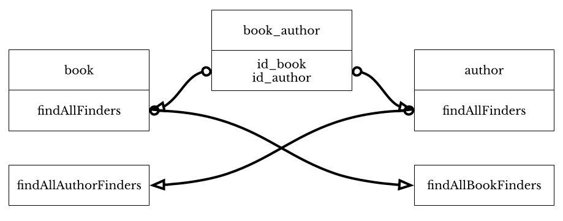

# Synapticloop h2zero

> 
> NOT READY FOR PRIMETIME YET - BUT WE ARE GETTING THERE
> 

> Rapidly generate you Object Relational Mapper, with you in total control of
> the underlying SQL

---


> lightweight ORM generator for mysql/sqlite, java with extensions for taglibs 
> and routemaster

# h2zero Niceties

## Database Support Built-In

h2zero supports the following database types:

 - CockroachDB
 - MariaDB
 - MySQL
 - PostgrSQL
 - SQLite3
 - Microsoft SQLServer

Alas, no Oracle (which is very unlikely to be supported at all), and no H2 
(which is slated for incorporation for automatic testing, but not for 
production systems).

## Generate Validated Boilerplate Code, … Automatically, and Easily

h2zero lets you configure your tables, fields, and interactions in a simple 
JSON format.  From this format it will generate all the code that you define, 
along with additional classes and methods to fully interact with your database.

## Interact With The Database In Every Way

Need to retrieve, count, question, delete, insert data?  h2zero allows you to 
easily define what you need done in a variety of ways.

And, of course, you can limit the interaction impact, with or without an offset, 
and within, or without a transaction.

## Modelled Sensibly

For each table, a model is built which maps directly to a single row of the 
database

## Linking Tables, Lock-In

A common pattern where you have a many to many 'linking' table, h2zero will 
allow you to find the linked table

For example:

A book may have multiple authors, and authors may write multiple books, by 
defining a table as 'linked', a book may easily find all authors, and an author 
may easily find all books without loading the linked table and iterating through 
its values.  The below book_author links the books and authors (and vice versa).  
Any findAll finders that are defined on a book model are made available to the 
author model, and any findAll finders that are defined on the author model are 
made available on the book model.



## Find What You Need, In Any Way You Need It
Data retrieval is fundamental to any database interaction - h2zero Finders are a 
powerful tool which can be defined  to easily

 - Select all rows
 - Select a subset of fields
 - Select by
   - nullable,
   - non-nullable,
   - Specific field values
   - _(Or any of the above, in any order)_
 - Use 'in' queries
 - Use cross joins to other tables

Of course, all finders can be ordered by any field or fields (either ascending 
or descending), with or without a limit clause, with or without an offset 
clause, and within, or without a transaction.

## Counting Values

Count all the rows, or just a subset of rows in a multitude of ways

 - Count all rows
 - Count by
   - nullable,
   - non-nullable,
   - Specific field values
   - _(Or any of the above, in any order)_
 - Use 'in' queries
 - Use cross joins to other tables

## Simple Questions

Define a way to answer simple boolean questions easily.  Question the database 
on the defined fields that may be

- nullable,
- non-nullable,
- specific field values
- _(Or any of the above, in any order)_
- Use 'in' queries
- Use cross joins to other tables

## Insert/Delete/Update

Need to interact behind the scenes, methods to insert, update, and delete are 
made available.


# Extensions

Extensions for h2zero are now supported see [https://github.com/synapticloop/h2zero-extension-routemaster-restful](https://github.com/synapticloop/h2zero-extension-routemaster-restful)


# Background

There are so many object relational mappers (ORMs) out there that do what h2zero does.  It isn't special, it just provides a link between your database and generates your Java code to be able to use it.

Unlike other ORMs, you have full control of the SQL that is generated.  So, if you

 - use MySQL
 - use Java
 - optionally use tomcat (JSPs/Tag Libraries/Servlets)
 
Then this is the ORM for you.
 
Unlike other ORMs, most (not all, but most) of the SQL must be hand-crafted by you, no horrible *best-effort* code  generation, no horrific un-parseable SQL statements in the logs.

You have complete control over the SQL statements that are executed meaning that you can optimise your statements the way you want them, not the way that the generator thinks you should.

Your database, just the way that you designed it.


# Requirements

 - **Java**
 - **MySQL**, _or_ **MariaDB**, _or_, **SQLServer**, _or_ **SQLite3**, _or_ 
   **PostgreSQL**, _or_ **CockroachDB**
 - **c3p0** _or_ **hikari** connection pooling
 - **gradle** or **command line usage**


# Creating a h2zero configuration file

By default the h2zero file would look like the following:


```
{
	"options": {
		...
	},
	"database": {
		"schema": "...",
		"package": "...",
		"tables": [
			"fields": [
				{...}
			],
			"fieldFinders": [
				{...}
			],
			"finders": [
				{...}
			],
			"deleters": [
				{...}
			],
			"inserters": [
				{...}
			],
			"updaters": [
				{...}
			],
			"questions": [
				{...}
			],
			"counters": [
				{...}
			],
			"constants": [
				{...}
			],
		], 
		"views": [
			{...}
		]
	}
	
}
```


# h2Zero generation

## gradle plugin

Assuming that you have included the plugin

```
h2zero {
	inFile = 'src/test/resources/sample.h2zero'
	outDir = '.'
	verbose = 'false'
}
```


## Command line generation

try


```
  java -jar h2zero-all.jar
```


which will output:


```
                        _______
                  __   |       |
                 |  |--|___|   .-----.-----.----.-----.
                 |     |/  ___/|-- __|  -__|   _|  _  |
                 |__|__|   |  \|_____|_____|__| |_____|
                       |       |      ... .-..
                       `-------'

                                 ~ ~ ~ * ~ ~ ~

# NOTE: h2zero may be invoked wither through the command line, or through the
# gradle build tool.

Usage:
  java -jar h2zero-all.jar \
     [command] \
     [-in file/path/h2zero.json] \
     [-out file/path] \
     [-verbose true|false]

Allowable command line options:

  +----------+------------+------------+----------------+--------------------+
  |          |  command   |            | Argument       |                    |
  | Option   |   h2zero   |  generate  | Format         | Default            |
  +----------+------------+------------+----------------+--------------------+
  | -in      | MANDATORY  | N/A        | File Path      |                    |
  | -out     | (optional) | N/A        | Directory Path | src/main/java      |
  | -verbose | (optional) | N/A        | boolean        | false              |
  +----------+------------+------------+----------------+--------------------+

Where:
  [command] is one of:
    generate - this will generate the source code from the provided h2zero
               file
     revenge - this will reverse engineer a database to an h2zero file

Each of the commands have different arguments depending on the command
invoked.

                                 ~ ~ ~ * ~ ~ ~

  [GENERATE] Generate the ORM code from the existing h2zero configuration
             file.

    java -jar h2zero-all.jar \
       generate \
       -in path_to_h2zero_file \
       [-out directory_path ] \
       [-verbose true_or_false]

    -in path_to_h2zero_file (mandatory) the input file to parse
    [-out directory_path] (optional) the directory to output the generated files, this
        will default to src/main/java
    [-verbose true_or_false] (optional) turn on verbose output, the default is 'false'

                                 ~ ~ ~ * ~ ~ ~

  [REVENGE] Reverse engineer a database JDBC connection to an h2zero file.

    java -jar h2zero-all.jar revenge

  IMPORTANT NOTE:
    You __MUST__  have the specific JDBC driver __AND__ the connection pooling
    jars on the library path for the database that you are attempting to
    reverse engineer from.

    The command line option will prompt you for the JDBC connection string,
    the username and a password (which will be masked)

                                 ~ ~ ~ * ~ ~ ~


Gradle build.gradle usage:
==========================+

If you are using gradle, you can add this to your build.gradle file

  h2zero {
    inFile = 'src/main/resources/your_file_name_here.h2zero'
    outDir = '.'
    verbose = 'false'
  }

```


# End Plate

```
# # # # # # # # # # # # # # # # # # # # # # # # # # # # # # # # # # # # # # # #
#                                                                             #
#                       __    _______                                         #
#                      |  |--|___    |.----.-----.----.-----.                 #
#                      |     |/  ___/|-- __|  -__|   _|  _  |                 #
#                      |__|__|  |   \|_____|_____|__| |_____|                 #
#                            `-------'      ... .-..                          #
#                                                                             #
#                                ~ ~ ~ * ~ ~ ~                                #
#                                                                             #
#                                                                             #
#                                   h2zero                                    #
#                                                                             #
#                                  ---------                                  #
#                                                                             #
# # # # # # # # # # # # # # # # # # # # # # # # # # # # # # # # # # # # # # # #

                         "Parting is such sweet sorrow"

                                                               Romeo And Juliet 
                                                                         Act 2, 
                                                                       Scene 2, 
                                                                       176–185
```

Text to ASCII art generation in the book from:

  - [Text to ASCII Art Generator](https://patorjk.com/software/taag/#p=display&f=Cricket&t=h2zero+&x=none&v=4&h=4&w=80&we=false) 

using a subtly modified `Cricket` font


